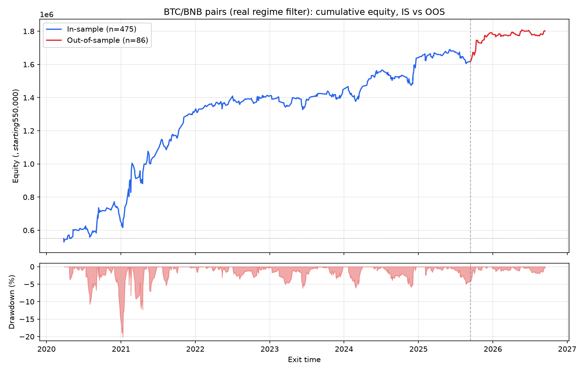

# Two-leg pairs variant — real regime filter (results only)

This folder holds the honest-measurement results for the full two-leg
BTC/BNB pairs variant run with the actual momentum-based regime filter this
research used — **not** the ADX filter shown in
[`../both_legs_adx/`](../both_legs_adx/).

**What's here and why:** the code for the real regime filter, and the
underlying trade-level journal, are not published — see the root
[README](../README.md) for why. Everything else about this result is real
and produced by the same honest-measurement pipeline as the public variant
(same beta-hedge sizing, same combined-P&L stop, same cost model — VIP3
Binance fees + funding — same walk-forward/cost-sensitivity/MAE-MFE suite)
— just with a different regime filter gating entries. The regime filter
itself is a momentum filter; nothing further about its inputs,
calculation, or thresholds is disclosed here.

Everything in this repo is independently runnable and verifiable except
reproducing this specific result, since the regime filter it depends on
isn't included.

## Headline (full history, VIP3 Binance fees + funding, both legs, $550k CAP)

| | Full | In-sample | Out-of-sample |
|---|---|---|---|
| Trades | 560 | 476 | 84 |
| Hit rate | 52.0% | 51.7% | 53.6% |
| Payoff ratio | 1.44 | 1.42 | 1.75 |
| Expectancy (% of CAP) | 0.41% | 0.41% | 0.39% |
| **Sharpe** | **1.22** | **1.23** | **1.82** |
| Calmar | 1.03 | 1.12 | 6.24 |
| Max drawdown | 20.2% | 20.2% | 4.9% |
| Ending equity | $1,802,817 | $1,622,037 | $730,780 |

OOS split: entries on/after 2025-09-14.

## Cost sensitivity (0x / 1x / 2x fee+funding multiplier)

| Scenario | Hit rate | Payoff | Expectancy (% of CAP) |
|---|---|---|---|
| Zero cost | 54.3% | 1.43 | 0.49% |
| Base cost | 52.0% | 1.44 | 0.41% |
| 2x cost | 50.9% | 1.37 | 0.33% |

Stays solidly positive at double the assumed cost.

## Walk-forward (6 sequential folds, expectancy as % of CAP)

`[0.80%, 0.78%, -0.07%, 0.41%, 0.22%, 0.31%]` — 5 of 6 folds positive.
Lag-1 fold-to-fold correlation: **-0.016** (essentially zero — not the
"positive persistence" signature a stable edge usually shows fold-to-fold,
though with only 6 folds this is a noisy estimate either way).

## MAE/MFE distribution (winners vs. losers, as % of CAP)

| Group | Metric | Median | p75 | p90 |
|---|---|---|---|---|
| Winners | MAE | 0.39% | 0.77% | 1.31% |
| Winners | MFE | 2.12% | 3.49% | 5.97% |
| Losers | MAE | 1.72% | 3.00% | 3.28% |
| Losers | MFE | 0.47% | 0.96% | 1.60% |

Clean separation: losers' median adverse excursion runs ~4.4x winners' —
losers tend to announce themselves early with a much bigger move against
the position before ultimately failing.

## Equity curve

See [`../graveyard.md`](../graveyard.md) for the full research history behind
this result, including the failed approaches along the way (the cost-blind
first search, the sizing bug, the ATR-stop redesign) — that record is
identical for the real and ADX variants, since it documents the shared
mechanism, not the regime filter specifically.
