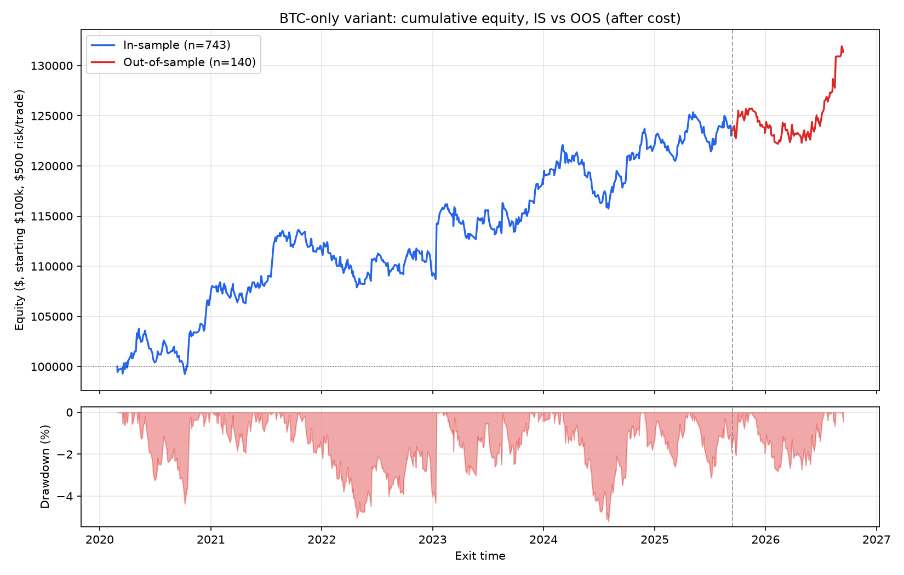

# Single-leg variant — real regime filter (results only)

This folder holds the honest-measurement results for the single-leg (BTC-only)
variant run with the actual momentum-based regime filter this research used —
**not** the ADX filter shown in [`../single_leg_adx/`](../single_leg_adx/).

**What's here and why:** the code for the real regime filter, and the
underlying trade-level journal, are not published — see the root
[README](../README.md) for why. Everything else about this result is real
and produced by the same honest-measurement pipeline as the public variant
(same engine, same cost model, same walk-forward/cost-sensitivity/MAE-MFE
suite) — just with a different regime filter gating entries. The regime
filter itself is a momentum filter; nothing further about its inputs,
calculation, or thresholds is disclosed here.

Everything in this repo is independently runnable and verifiable except
reproducing this specific result, since the regime filter it depends on
isn't included.

## Headline (full history, IBKR costs, $100k account / $500 risk per trade)

| | Full | In-sample | Out-of-sample |
|---|---|---|---|
| Trades | 883 | 744 | 139 |
| Hit rate (after cost) | 48.4% | 48.7% | 46.8% |
| Payoff ratio | 1.32 | 1.28 | 1.57 |
| Expectancy (R) | 0.071 | 0.063 | 0.112 |
| **Sharpe** | **0.83** | **0.75** | **1.26** |
| Calmar | 0.83 | 0.77 | 2.21 |
| Max drawdown | 5.2% | 5.2% | 3.5% |
| Ending equity | $131,328 | $123,550 | $107,778 |

OOS split: entries on/after 2025-09-14.

## Cost sensitivity (0x / 1x / 2x)

| Scenario | Hit rate | Payoff | Expectancy (R) |
|---|---|---|---|
| Zero cost | 51.2% | 1.35 | 0.113 |
| Base cost | 48.4% | 1.32 | 0.071 |
| 2x cost | 46.3% | 1.26 | 0.028 |

Stays solidly positive at double the assumed IBKR cost.

## Walk-forward (6 sequential folds, expectancy_r)

`[0.096, 0.021, 0.072, 0.043, 0.099, 0.095]` — all six folds positive.
Lag-1 fold-to-fold correlation: **-0.35**. Worth being direct about this:
that's not the "positive persistence" signature a real, stable edge
usually shows fold-to-fold — with only 6 folds it's a noisy estimate, but
it's reported as-is rather than smoothed over.

## MAE/MFE distribution (winners vs. losers, in R)

| Group | Metric | Median | p75 | p90 |
|---|---|---|---|---|
| Winners | MAE | 0.222 | 0.367 | 0.594 |
| Winners | MFE | 0.836 | 1.455 | 2.480 |
| Losers | MAE | 0.742 | 1.057 | 1.193 |
| Losers | MFE | 0.219 | 0.446 | 0.756 |

Clean separation: losers' adverse excursion (MAE) runs ~3.3x winners' median
— consistent with the same "losers announce themselves early" pattern this
research found in the two-leg variant too.

## Equity curve

See [`../graveyard.md`](../graveyard.md) for the full research history behind
this result, including the failed approaches along the way — that record is
identical for the real and ADX variants, since it documents the shared
mechanism, not the regime filter specifically.
